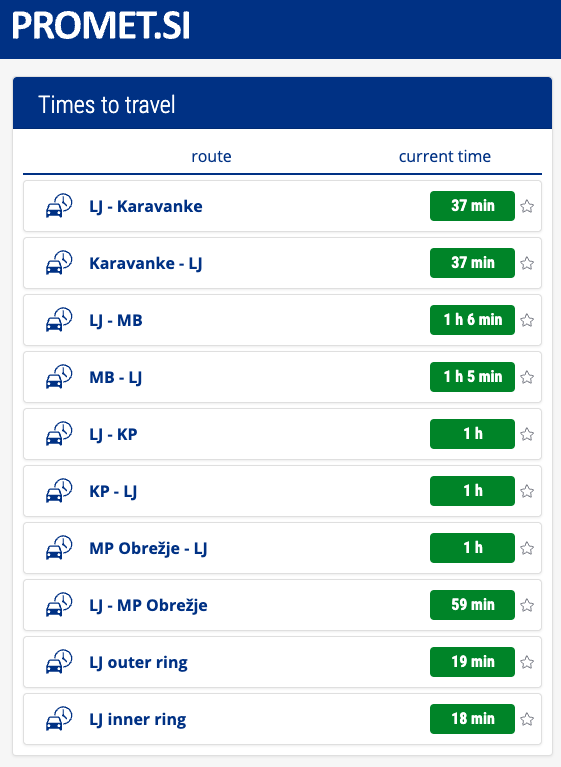
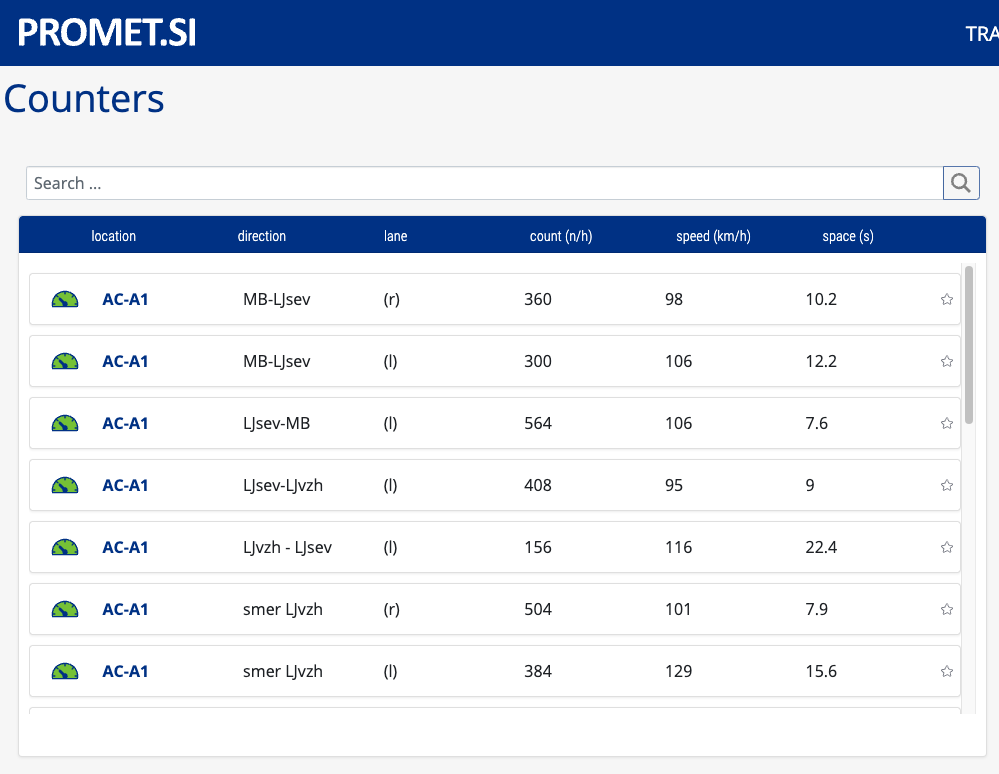

# Web Scraper for Travel Times and Vehicle Counters from promet.si

## Overview
This repository contains two web scrapers implemented using Selenium in Python. The scrapers are designed to extract travel times and vehicle count data from promet.si.

## Scrapers
- <b>Travel Times Scraper</b>: Collects travel time data from some routes in Slovenia.



<br>
- <b>Vehicle Counters Scraper</b>: Collects vehicle count data on highways in Slovenia. It can search locations and scroll to take all the data from dynamic table.



## Prerequisites
Ensure you have the following installed:

- Python 3.x
- Selenium
- Chrome

## Usage

### Travel Times Scraper

Navigate to 'travel_times_scraper' directory:
```python
cd travel_times_scraper
```

Run the scraper:
```python
python travel_times_scraper.py
```

Data saved to csv:
- datetime
- latitude
- longitude
- location_name
- minutes
- traffic_type

### Vehicle Counters Scraper

Navigate to 'vehicle_counters_scraper' directory:
```python
cd vehicle_counters_scraper
```

Run the scraper:
```python
python vehicle_counters_scraper.py
```

Data saved to csv:
- datetime
- latitude
- longitude
- location_name
- number_of_vehicles_left_lane
- number_of_vehicles_right_lane
- speed_right_lane
- speed_left_lane
- spacing_in_sec_right_lane
- spacing_in_sec_left_lane
- density_type_right_lane
- density_type_left_lane
